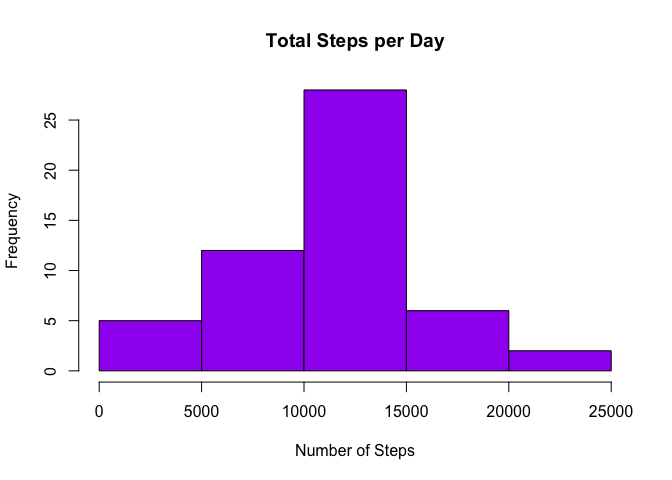
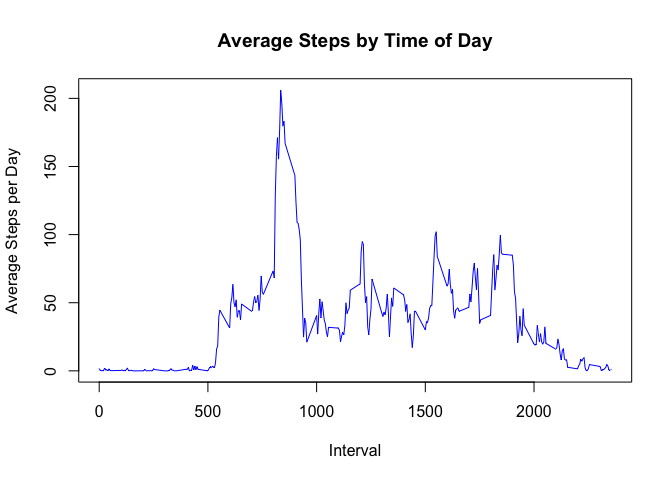
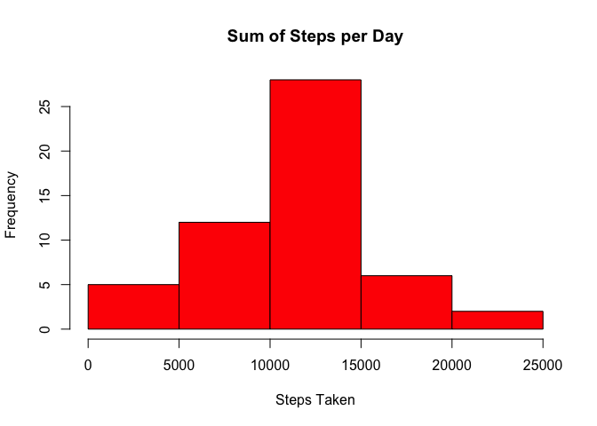
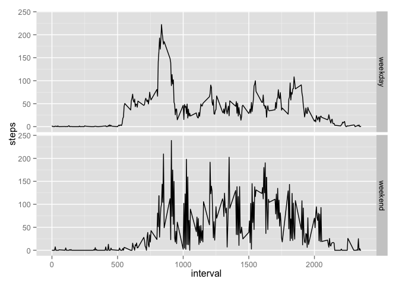

# Reproducible Research: Peer Assessment 1


## Loading and preprocessing the data


```r
unzip("activity.zip")
act <- read.csv("activity.csv")
act$date <- strptime(act$date, format = "%Y-%m-%d")
```

## What is mean total number of steps taken per day?


```r
act2 <- na.omit(act)
hist(tapply(act2$steps, as.numeric(act2$date), sum), main = "Total Steps per Day", 
     col = "purple", xlab = "Number of Steps")
```

 

```r
meanSteps <- tapply(act2$steps, as.numeric(act2$date), mean)
medianSteps <- tapply(act2$steps[act2>0], as.numeric(act2$date[act2>0]), 
        median, na.rm = TRUE)
meanMedian <- cbind(rownames(table(as.character(act2$date))), meanSteps, medianSteps)
meanMedian
```

```
##                         meanSteps           medianSteps
## 1349161200 "2012-10-02" "0.4375"            "63"       
## 1349247600 "2012-10-03" "39.4166666666667"  "61"       
## 1349334000 "2012-10-04" "42.0694444444444"  "56.5"     
## 1349420400 "2012-10-05" "46.1597222222222"  "66"       
## 1349506800 "2012-10-06" "53.5416666666667"  "67"       
## 1349593200 "2012-10-07" "38.2465277777778"  "52.5"     
## 1349766000 "2012-10-09" "44.4826388888889"  "48"       
## 1349852400 "2012-10-10" "34.375"            "56.5"     
## 1349938800 "2012-10-11" "35.7777777777778"  "35"       
## 1350025200 "2012-10-12" "60.3541666666667"  "46"       
## 1350111600 "2012-10-13" "43.1458333333333"  "45.5"     
## 1350198000 "2012-10-14" "52.4236111111111"  "60.5"     
## 1350284400 "2012-10-15" "35.2048611111111"  "54"       
## 1350370800 "2012-10-16" "52.375"            "64"       
## 1350457200 "2012-10-17" "46.7083333333333"  "61.5"     
## 1350543600 "2012-10-18" "34.9166666666667"  "52.5"     
## 1350630000 "2012-10-19" "41.0729166666667"  "74"       
## 1350716400 "2012-10-20" "36.09375"          "49"       
## 1350802800 "2012-10-21" "30.6284722222222"  "48"       
## 1350889200 "2012-10-22" "46.7361111111111"  "52"       
## 1350975600 "2012-10-23" "30.9652777777778"  "56"       
## 1351062000 "2012-10-24" "29.0104166666667"  "51.5"     
## 1351148400 "2012-10-25" "8.65277777777778"  "35"       
## 1351234800 "2012-10-26" "23.5347222222222"  "36.5"     
## 1351321200 "2012-10-27" "35.1354166666667"  "72"       
## 1351407600 "2012-10-28" "39.7847222222222"  "61"       
## 1351494000 "2012-10-29" "17.4236111111111"  "54.5"     
## 1351580400 "2012-10-30" "34.09375"          "40"       
## 1351666800 "2012-10-31" "53.5208333333333"  "83.5"     
## 1351839600 "2012-11-02" "36.8055555555556"  "55.5"     
## 1351926000 "2012-11-03" "36.7048611111111"  "59"       
## 1352102400 "2012-11-05" "36.2465277777778"  "66"       
## 1352188800 "2012-11-06" "28.9375"           "52"       
## 1352275200 "2012-11-07" "44.7326388888889"  "58"       
## 1352361600 "2012-11-08" "11.1770833333333"  "42.5"     
## 1352620800 "2012-11-11" "43.7777777777778"  "55"       
## 1352707200 "2012-11-12" "37.3784722222222"  "42"       
## 1352793600 "2012-11-13" "25.4722222222222"  "57"       
## 1352966400 "2012-11-15" "0.142361111111111" "20.5"     
## 1353052800 "2012-11-16" "18.8923611111111"  "43"       
## 1353139200 "2012-11-17" "49.7881944444444"  "65.5"     
## 1353225600 "2012-11-18" "52.4652777777778"  "80"       
## 1353312000 "2012-11-19" "30.6979166666667"  "34"       
## 1353398400 "2012-11-20" "15.5277777777778"  "58"       
## 1353484800 "2012-11-21" "44.3993055555556"  "55"       
## 1353571200 "2012-11-22" "70.9270833333333"  "65"       
## 1353657600 "2012-11-23" "73.5902777777778"  "113"      
## 1353744000 "2012-11-24" "50.2708333333333"  "65.5"     
## 1353830400 "2012-11-25" "41.0902777777778"  "84"       
## 1353916800 "2012-11-26" "38.7569444444444"  "53"       
## 1354003200 "2012-11-27" "47.3819444444444"  "57"       
## 1354089600 "2012-11-28" "35.3576388888889"  "70"       
## 1354176000 "2012-11-29" "24.46875"          "44.5"
```

## What is the average daily activity pattern?


```r
meanInterval <- cbind(rownames(table(act2$interval)), tapply(act2$steps, 
        act2$interval, mean))
plot(meanInterval[,1], meanInterval[,2], type = "l", col = "blue", xlab = 
        "Interval", ylab = "Average Steps per Day", 
        main = "Average Steps by Time of Day")
```

 

```r
maxSteps <- c(subset(meanInterval, meanInterval[,2] ==
        max(as.numeric(meanInterval[,2])), select = 
        meanInterval[,1]:meanInterval[,2]), max(as.numeric(meanInterval[,2])))
```

```
## Warning in meanInterval[, 1]:meanInterval[, 2]: numerical expression has
## 288 elements: only the first used
```

```
## Warning in meanInterval[, 1]:meanInterval[, 2]: numerical expression has
## 288 elements: only the first used
```

```r
maxSteps
```

```
## [1] "835"              "206.169811320755"
```

## Imputing missing values

This missing values will be replaced by the mean steps in the code below.


```r
sum(is.na(act))
```

```
## [1] 2304
```

```r
act3 <- act
for (i in which(is.na(act3))){
        act3[i,1] <- meanSteps[((i-1)%%288)+1]
}
hist(tapply(act3$steps, as.numeric(act3$date), sum), col = "red", 
     main = "Sum of Steps per Day", xlab = "Steps Taken")
```

 

```r
meanSteps2 <- tapply(act3$steps, as.numeric(act3$date), mean)
medianSteps2 <- tapply(act3$steps[act2>0], as.numeric(act3$date[act2>0]), 
        median, na.rm = TRUE) # THIS IS BROKEN
meanMedian2 <- cbind(rownames(table(as.character(act3$date))), meanSteps2, 
        medianSteps2)
meanMedian2
```

```
##                         meanSteps2          medianSteps2      
## 1349074800 "2012-10-01" NA                  NA                
## 1349161200 "2012-10-02" "0.4375"            "0"               
## 1349247600 "2012-10-03" "39.4166666666667"  "0"               
## 1349334000 "2012-10-04" "42.0694444444444"  "27"              
## 1349420400 "2012-10-05" "46.1597222222222"  "15.5"            
## 1349506800 "2012-10-06" "53.5416666666667"  "6.5"             
## 1349593200 "2012-10-07" "38.2465277777778"  "28"              
## 1349679600 "2012-10-08" NA                  "39.4166666666667"
## 1349766000 "2012-10-09" "44.4826388888889"  "15"              
## 1349852400 "2012-10-10" "34.375"            "13"              
## 1349938800 "2012-10-11" "35.7777777777778"  "0"               
## 1350025200 "2012-10-12" "60.3541666666667"  "20"              
## 1350111600 "2012-10-13" "43.1458333333333"  "7"               
## 1350198000 "2012-10-14" "52.4236111111111"  "0"               
## 1350284400 "2012-10-15" "35.2048611111111"  "0"               
## 1350370800 "2012-10-16" "52.375"            "17.5"            
## 1350457200 "2012-10-17" "46.7083333333333"  "0"               
## 1350543600 "2012-10-18" "34.9166666666667"  "0"               
## 1350630000 "2012-10-19" "41.0729166666667"  "0"               
## 1350716400 "2012-10-20" "36.09375"          "0"               
## 1350802800 "2012-10-21" "30.6284722222222"  "0"               
## 1350889200 "2012-10-22" "46.7361111111111"  "0"               
## 1350975600 "2012-10-23" "30.9652777777778"  "0"               
## 1351062000 "2012-10-24" "29.0104166666667"  "0"               
## 1351148400 "2012-10-25" "8.65277777777778"  "0"               
## 1351234800 "2012-10-26" "23.5347222222222"  "0"               
## 1351321200 "2012-10-27" "35.1354166666667"  "5.5"             
## 1351407600 "2012-10-28" "39.7847222222222"  "18"              
## 1351494000 "2012-10-29" "17.4236111111111"  "0"               
## 1351580400 "2012-10-30" "34.09375"          "0"               
## 1351666800 "2012-10-31" "53.5208333333333"  "3"               
## 1351753200 "2012-11-01" NA                  NA                
## 1351839600 "2012-11-02" "36.8055555555556"  "0"               
## 1351926000 "2012-11-03" "36.7048611111111"  "0"               
## 1352012400 "2012-11-04" NA                  NA                
## 1352102400 "2012-11-05" "36.2465277777778"  "0"               
## 1352188800 "2012-11-06" "28.9375"           "6"               
## 1352275200 "2012-11-07" "44.7326388888889"  "18"              
## 1352361600 "2012-11-08" "11.1770833333333"  "0"               
## 1352448000 "2012-11-09" NA                  NA                
## 1352534400 "2012-11-10" NA                  NA                
## 1352620800 "2012-11-11" "43.7777777777778"  "25"              
## 1352707200 "2012-11-12" "37.3784722222222"  "0"               
## 1352793600 "2012-11-13" "25.4722222222222"  "0"               
## 1352880000 "2012-11-14" NA                  NA                
## 1352966400 "2012-11-15" "0.142361111111111" "0"               
## 1353052800 "2012-11-16" "18.8923611111111"  "0"               
## 1353139200 "2012-11-17" "49.7881944444444"  "0"               
## 1353225600 "2012-11-18" "52.4652777777778"  "0"               
## 1353312000 "2012-11-19" "30.6979166666667"  "0"               
## 1353398400 "2012-11-20" "15.5277777777778"  "0"               
## 1353484800 "2012-11-21" "44.3993055555556"  "0"               
## 1353571200 "2012-11-22" "70.9270833333333"  "38.5"            
## 1353657600 "2012-11-23" "73.5902777777778"  "0"               
## 1353744000 "2012-11-24" "50.2708333333333"  "0"               
## 1353830400 "2012-11-25" "41.0902777777778"  "0"               
## 1353916800 "2012-11-26" "38.7569444444444"  "0"               
## 1354003200 "2012-11-27" "47.3819444444444"  "0"               
## 1354089600 "2012-11-28" "35.3576388888889"  "0"               
## 1354176000 "2012-11-29" "24.46875"          "0"               
## 1354262400 "2012-11-30" NA                  "37.3784722222222"
```

```r
mean(act3$steps, na.rm = TRUE)
```

```
## [1] 37.3826
```

```r
median(act3$steps, na.rm = TRUE) # THIS IS BROKEN
```

```
## [1] 0
```

```r
mean(act3$steps, na.rm = TRUE) - mean(act$steps, na.rm = TRUE)
```

```
## [1] 0
```

```r
median(act3$steps[act2>0], na.rm = TRUE) - median(act$steps[act2>0], na.rm = TRUE)
```

```
## [1] 0
```

The mean and median from the original dataset and that with averaged NA values
is identical.  Adding mean NA values did, however, increase the daily sum of
steps taken.

## Are there differences in activity patterns between weekdays and weekends?


```r
require(ggplot2)
```

```
## Loading required package: ggplot2
```

```r
weekend <- c("Saturday", "Sunday")
act[, "weekday"] <- ifelse(weekdays(act$date) == weekend, "weekend", "weekday")
avg <- aggregate(steps ~ interval + weekday, data = act, mean)
ggplot(avg, aes(interval, steps)) +
        geom_line() + facet_grid(weekday ~.)
```

 
